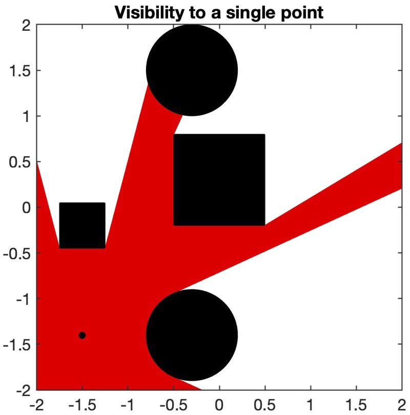
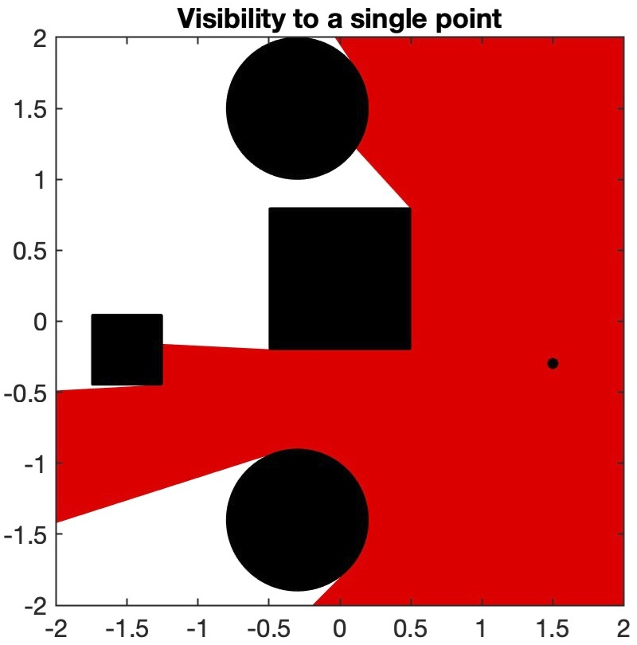
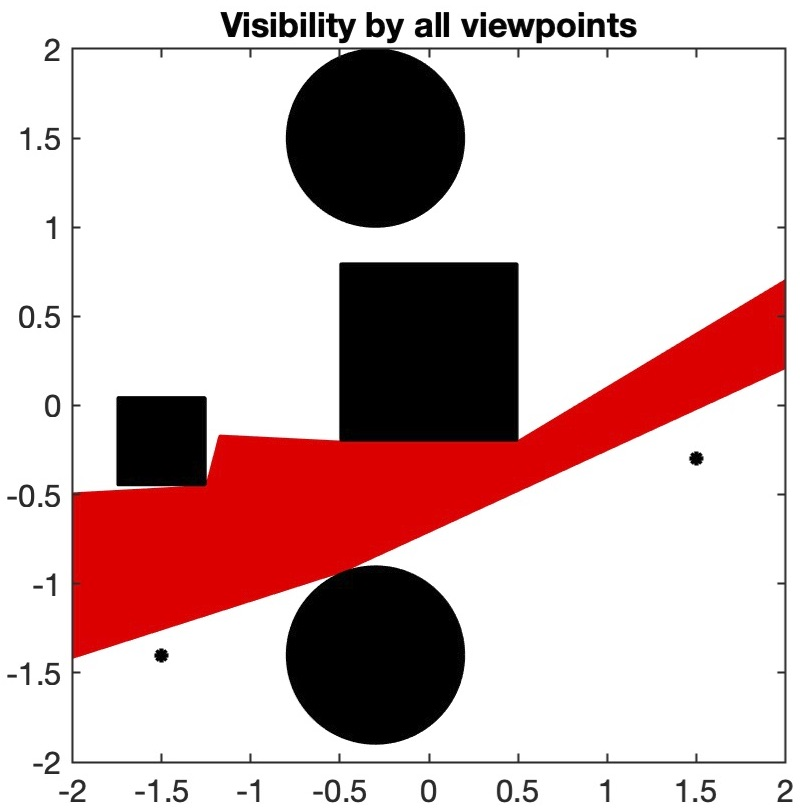
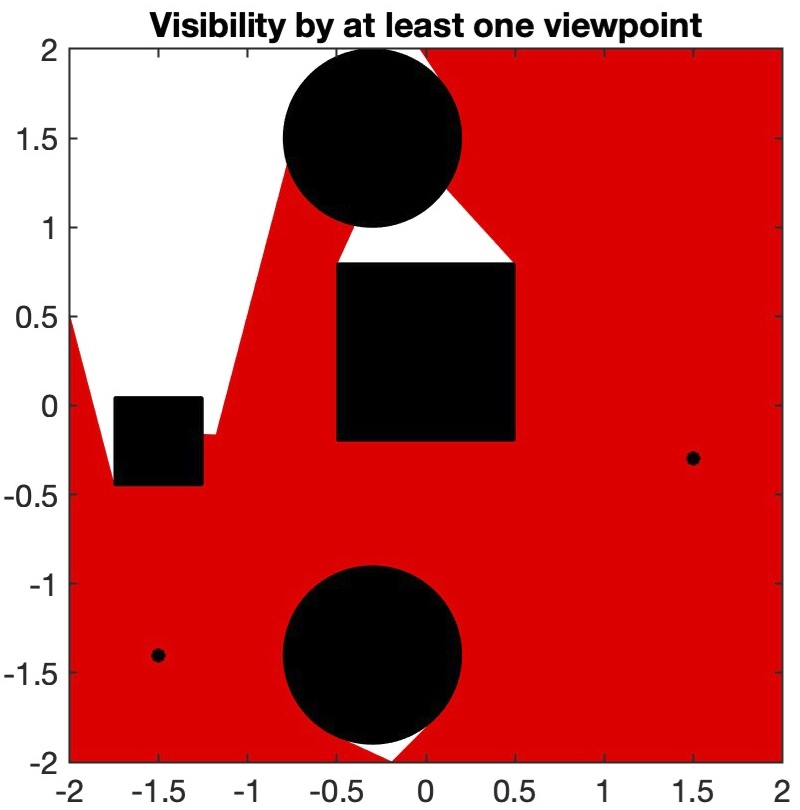
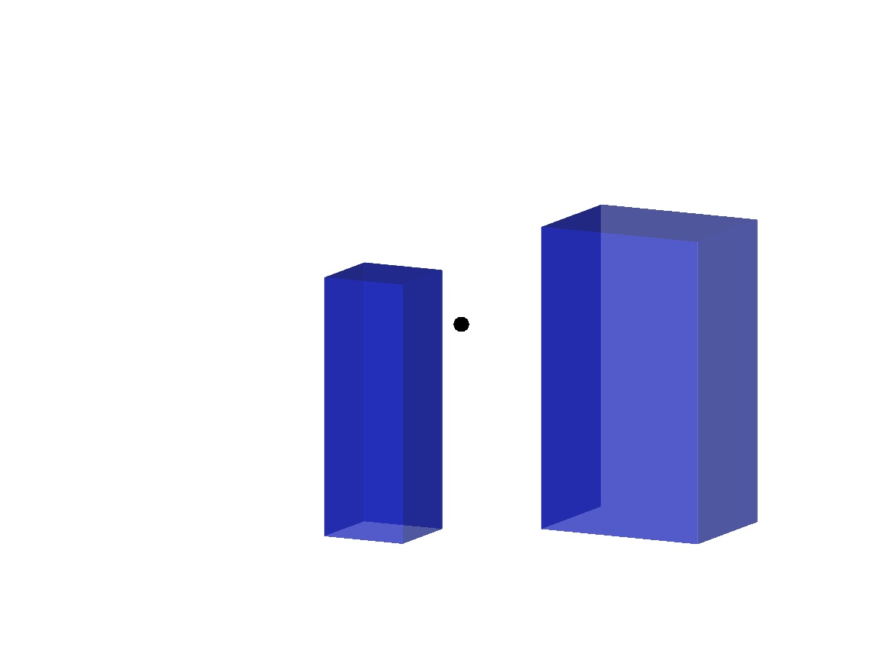
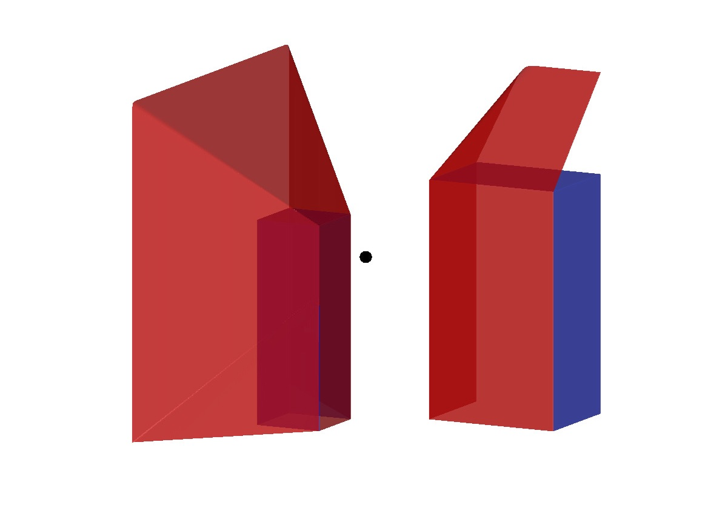
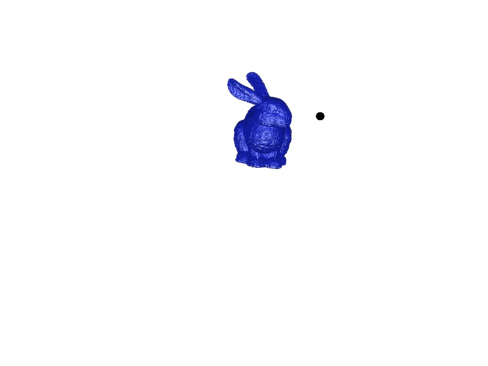
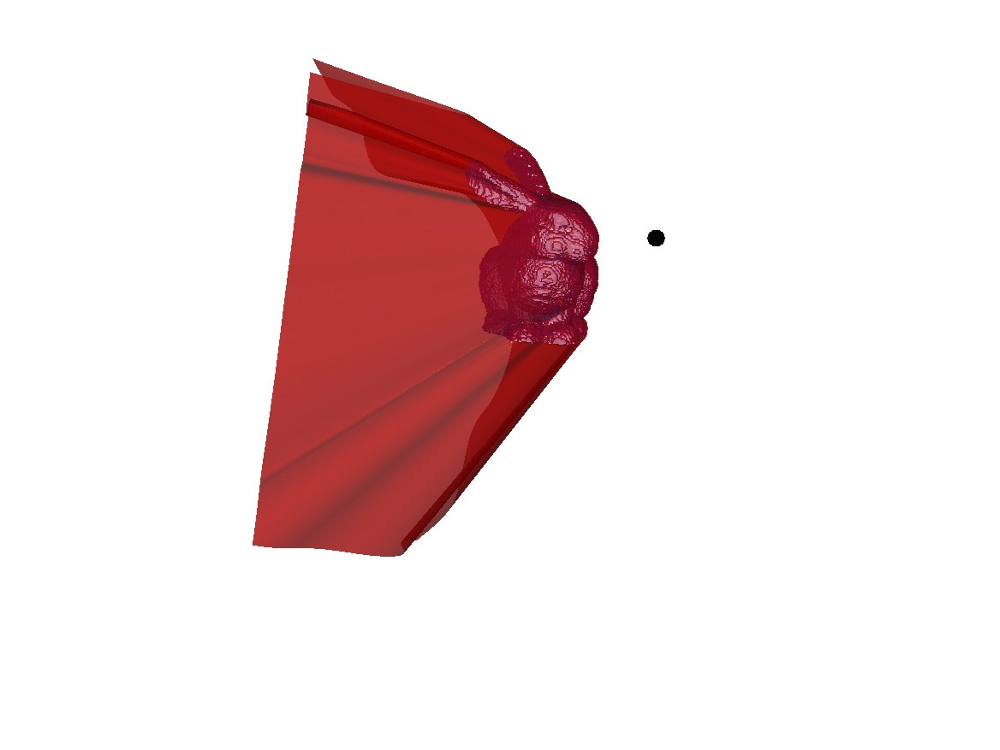

# Visibility PDE
This repo contains code for the paper [A Partial Differential Equation Obstacle Problem for the Level Set Approach to Visibility](https://doi.org/10.1007/s10915-019-01106-x).

## Code

The script `example_2D.m` illustrates the different solvers available in 2D. These include determining the visibility set to a single point as well as multiple viewpoints.
Running this scrpit will determine the visibility sets below
  
<p align="center">




</p>

The script `example_3D.m` contains a 3D example where the obstacles are two buildings.
<p align="center">


</p>

The script `example_bunny.m` determines the visibility set when the obstacle is a bunny shape.
<p align="center">


</p>

## Citation
If you use this paper or code in your scientific work, please cite as
```
@article{VisibilityPdeObermanSalvador,
  title     = {A Partial Differential Equation Obstacle Problem for the Level Set Approach to Visibility},
  author    = {Oberman, Adam and Salvador, Tiago},
  journal   = {Journal of Scientific Computing},
  volume    = {82},
  number    = {1},
  pages     = {14},
  year      = {2020},
  publisher = {Springer}
}
```
